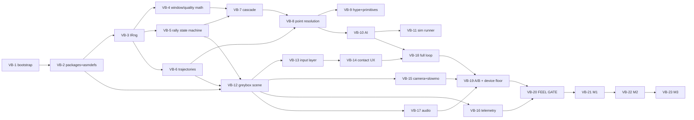

# MVP Backlog — Bootstrap → M0 Gate → M3

Ticket conventions: `VB-N` ids are stable. **Blocked by** = hard dependency (don't start until closed). Spec refs are normative — the ticket is the pointer, the doc is the spec. Every ticket must land with its tests per `docs/data-schemas.md §5`; no formatter/lint/project-wide-suite runs inside a ticket — verify only what the ticket touches.

Priorities: `P0` = critical path now · `P1` = M0 scope · `P2` = post-gate.

## Status — 2026-07-13 (update this table with every landing commit)

| Ticket | State | Evidence |
|---|---|---|
| VB-1 | ✅ Unity 6000.0.79f1 + iOS installed (headless), licensed, first open clean on pinned version; LFS/hygiene done | `fdc730a`, `3b37f79`, `2bd1024` |
| VB-2 | ✅ packages resolved, asmdef graph compiles in-editor, both test asms run (169 EditMode + 1 PlayMode green in Unity) | `fdc730a`, `2bd1024` |
| VB-3 | ✅ RNG streams, golden-pinned | `fdc730a` |
| VB-4 | ✅ window/quality math (constants audited vs §3) | `88ae07b` |
| VB-5 | ✅ rally state machine, table 1:1 | `88ae07b` |
| VB-6 | ✅ trajectories + net rulings + zone grid | `88ae07b` |
| VB-7 | ✅ cascade matrices | `15f0861` |
| VB-8 | ✅ §3.6 point-resolution pipeline | `15f0861` |
| VB-9 | ✅ Hype/Ignition + primitives (a)–(f) | `cf65858` |
| VB-10 | ✅ AI utility/sampling/vocabulary | `cf65858` |
| VB-11 | ✅ runner (batch/mirror/transcript/sweep/calibrate/economy), JSON reports, skill proxies — all three standing suites operational | `2caac05`+ |
| VB-12 | ◐ tick engine + grey-box view VERIFIED in-editor (PlayMode smoke: self-boot + ball flight). Remaining AC: on-device 60fps + zero-GC profiler capture (needs a phone build — pairs with VB-19) | `3b37f79`, `2bd1024` |
| VB-13 | ◐ engine-free core COMPLETE: §7.1 gesture grammar + §7.3 forgiveness, §4.3 swipe→shot with boundary safety, quantized PlayerInput replay events, human side in MatchSim (serve meter, receive commit+tap, set choice, spike with §3.5 ctx, deferred dig) through REAL windows + §7.4 assist; **replay-identity AC green** ((seed+input log) ⇒ bit-identical). Remaining: Unity touch binding + on-device checklist (lands with VB-14) | — |
| VB-14..20 | ▶ VB-14 (touch binding + timing-ring UX = the playable demo) is next | — |
| VB-21..23 | ⏳ gate-blocked by design | — |

Suite: **188 EditMode tests green via dotnet** (`~/.dotnet/dotnet test tools/VG.SimTests/VG.SimTests.csproj`); in-editor suites re-run at each Unity-side change. Note: UTF's NUnit has no `Assert.Multiple` — classic asserts only.

**Unticketed work landed:** `MatchSim` composition layer (`Assets/Scripts/Gameplay/Match/`) — full deterministic AI-vs-AI headless matches; implicit prerequisite of VB-11, consumed by VB-12/VB-18. Demo: `~/.dotnet/dotnet run --project tools/VG.SimRunner -c Release -- transcript --tier Normal --seed 42`.

**Balance findings (updated after the serve-receive sweep):**
- Mirror suite PASS at tuned defaults (51.45%/2000, CI contains 50%).
- `ServeReceiveRequirementFactor` swept 1.00→0.55 and set to **0.80**: two-contact rallies 43.1% → 16.4%, median 4.0, mean 5.58. Spec §3.6 updated. Residual shape watch: Tooled ~32% / Net ~27% share at 0.80 — knobs are `ToolMargin`/`NetFloorQuality`/edge-out thresholds; tune with human feel in M0 W7–8, not blind.
- **Tier calibration MISS (the suite's first real verdict):** Median proxy beats Easy 98% (band 80–92), loses to Normal at 27.5% (band 55–72), 0% vs Hard (band 32–48). §6.2 tier distributions are spread too wide — current Normal executes above a median player. Direction: compress tiers downward (Normal ≈ halfway to current Easy); joint-tune with proxy defs when human data exists.
- **Economy §8.2 suite PASS:** Skilled proxy at PI−0.08 (raw 84) wins 61.0% vs Normal at raw 100 (floor 30%) — "stats assist, skill decides" holds numerically.

**Design decisions promoted from code to spec:** Ignition latches (m0-gameplay-spec §3.7 note); AI v0 bypasses §3.5 spike-window ctx (§6.2 note); serve-receive factor 0.80 (§3.6 note).

## Dependency graph

## Phase B — Bootstrap

### VB-1 · Unity 6 project + repo hygiene · P0
Refs: tooling-pipeline §3.
- Unity 6 LTS (6000.0 stream) URP project at repo root; ProjectVersion.txt committed; patch upgrades only at milestone boundaries.
- EditorSettings: Force Text serialization + Visible Meta Files; `.gitattributes` LF; Unity `.gitignore`; git-lfs tracking models/textures/audio/video/fonts (YAML assets stay plain git).
**AC:** fresh clone opens clean on the pinned version; a scene edit diffs as reviewable YAML text; binaries route through LFS.

### VB-2 · Packages + asmdef skeleton · P0 · blocked by VB-1
Refs: tooling-pipeline §3 package table; data-schemas §3.
- Install: URP, Input System, Cinemachine 3.x, Timeline, Addressables, Unity Test Framework, UniVRM (git-pinned), PrimeTween, Newtonsoft JSON.
- Asmdefs: `VG.Data`, `VG.Gameplay`, `VG.Meta`, `VG.UI`, `VG.Tests.EditMode`, `VG.Tests.PlayMode`, `VG.EditorTools` with the data-schemas §3 dependency directions (Gameplay NEVER references Meta).
**AC:** all packages resolve; an intentional Gameplay→Meta reference fails compilation; one empty smoke test green in each test asm.

## Phase C — Deterministic core (pure C#, engine-free)

### VB-3 · IRng + named streams · P0 · blocked by VB-2
Refs: data-schemas §4.1.
- `IRng`, streams {Gacha, Rally, Ai, Substats}; splitmix64 per-stream seed derivation; xoshiro128**; serializable state.
**AC (EditMode):** same seed ⇒ identical sequences; consuming one stream never shifts another; state round-trips.

### VB-4 · StatBlock, timing windows, quality formula · P1 · blocked by VB-3
Refs: m0-gameplay-spec §3.1–3.2; data-schemas §1.1.
- Raw 0–200 → /200 normalization; window = base_ms × (1+k·stat) × ctx × assist; quality = floor + grade_coeff × (ceiling − floor); receive grades S/A/B/C/Shank thresholds. All constants in ONE tunables asset.
**AC (EditMode):** boundary-ms exact-edge tests; clamps at stat 0/1; grade thresholds exhaustive per data-schemas §5.1.

### VB-5 · Rally state machine · P1 · blocked by VB-3
Refs: m0-gameplay-spec §1 (14 states, 18 transitions, interrupt rules).
**AC (EditMode):** transition table implemented 1:1; illegal transitions throw; scripted sequences reach `PointResolved` from every contact state; signature/Ignition interrupts honored.

### VB-6 · Ball trajectory model · P1 · blocked by VB-3
Refs: m0-gameplay-spec §2 (piecewise quadratic bezier, per-contact params, net/antenna/bounds, 1/60 tick).
**AC (EditMode):** deterministic position for (params, tick); net/bounds intersection cases; all six contact-type param sets data-driven.

### VB-7 · Quality cascade · P1 · blocked by VB-4, VB-5
Refs: m0-gameplay-spec §3 (receive→set-options matrix; set-grade→spike-window scaling).
**AC (EditMode):** matrices exhaustively tested — every receive grade × option lit/dark; every set grade × window scale.

### VB-8 · Point-resolution pipeline · P1 · blocked by VB-6, VB-7
Refs: m0-gameplay-spec §3 (8-step resolution → {kill, blocked, tooled, dug, out, net}; ⚄ points on Rally stream only).
**AC (EditMode):** outcome table incl. Shank-receive, Perfect-everything, aim-into-committed-block; same seed+inputs ⇒ identical outcome (replay determinism at the core level).

### VB-9 · Hype/Ignition + signature primitives engine · P1 · blocked by VB-8
Refs: PLAN §2.3; m0-gameplay-spec §3 accrual table; primitives (a)–(f).
**AC (EditMode):** accrual matches table; Ignition threshold transitions; one dedicated test per primitive (a)–(f) per data-schemas §5.1.

### VB-10 · AI: utility scoring + tier distributions · P1 · blocked by VB-8
Refs: m0-gameplay-spec §6.
- U = Σwᵢxᵢ with spec weight tables; grade-probability distributions per tier; tactic vocabulary unlocks; consumes Ai stream only.
**AC (EditMode):** legal action at every decision point across 1k seeded rallies; realized grade distributions within tolerance of spec tables; grep-level check: no player-input latency pathway exists.

### VB-11 · Headless SimRunner + mirror-match suite · P1 · blocked by VB-10
Refs: tooling-pipeline §2.
- `tools/VG.SimRunner` .NET console csproj source-including the pure-sim folders; LineupSpec/skill-proxy inputs; JSON + markdown reports.
- Mirror-match suite: 2k seeds per format, CI contains 0.50, |bias| ≤ 3pp.
**AC:** `dotnet run` emits report; UnityEngine reference = build error (leak canary); mirror suite passing or the side/serve bias bug is filed with the failing report attached.

## Phase U — Unity layer (grey-box)

### VB-12 · Grey-box scene + fixed-tick driver · P1 · blocked by VB-2, VB-5, VB-6
Refs: m0-gameplay-spec §8 scene inventory.
- Court, capsules, net; 1/60 fixed sim tick with interpolated rendering.
**AC:** AI-vs-AI rally runs on device at 60fps; forcing 30fps render leaves sim tick count unchanged (test); zero per-frame GC allocs in rally steady-state (profiler capture).

### VB-13 · Input layer · P1 · blocked by VB-12
Refs: m0-gameplay-spec §7; data-schemas §4.3.
- Tap / hold-release / swipe / drag; 100ms buffer; mis-input forgiveness; assist widen 0/25/50%; inputs quantized into replay-format events.
**AC:** gesture mapping unit-tested where engine-free; on-device checklist for the rest; a recorded input log replays into the identical rally outcome.

### VB-14 · Contact UX (timing ring + aim) · P1 · blocked by VB-13
Refs: ui-screens §3; m0-gameplay-spec §3–4.
- Window-proportional timing ring (bands = actual ms; assist variant dashed); serve drag-aim with line-proximity shrink; set lane picker (≤3s slowed decision); spike swipe→zone; block column swipe.
**AC:** all five contact interactions playable in grey-box; ring band widths verified against §3.1 window math for three stat spreads.

### VB-15 · Camera director v1 + slow-mo · P1 · blocked by VB-12
Refs: m0-gameplay-spec §5 (12-shot list, both orientations, dilation factors).
**AC:** every shot in the table triggerable via debug menu; slow-mo dilation per spec; orientation swap switches rig sets without reframing bugs.

### VB-16 · Telemetry JSONL + gate charts · P1 · blocked by VB-12
Refs: m0-hardening §2; tooling-pipeline (chart tooling ownership).
- 7 events + perf_sample + envelope; local JSONL sink, no vendor SDK.
- Chart script rendering the 5 feel-gate charts with pass/investigate thresholds annotated.
**AC:** golden session validates against the schema; charts render from a real device session.

### VB-17 · Placeholder audio: adaptive layers + SFX matrix · P1 · blocked by VB-12
Refs: m0-hardening §3.
- Music state machine (M_Warmup→M_Ignition + match-point override, bar-quantized, 250ms crossfade); 6 contact types × 4 grades SFX with the shared Perfect signature layer; temp assets.
**AC:** scripted Hype ramp audibly walks the layer states; every contact×grade plays a distinct cue; CI/device build refuses "silent" configuration (gate-evidence rule).

### VB-18 · Full loop: human vs AI to-11 match · P1 · blocked by VB-10, VB-14
Refs: contract match formats; m0-gameplay-spec §1.
**AC:** complete to-11 quick match on device vs Easy and Normal; rotation/sideout legality enforced; end-to-end telemetry captured for the session.

### VB-19 · Orientation A/B + device-floor protocol · P1 · blocked by VB-15, VB-17, VB-18
Refs: m0-gameplay-spec §8 A/B criteria; m0-hardening §1.
- Same build, both orientations; 15-min thermal protocol on iPhone SE3 + Galaxy A52s with perf_sample capture; degradation ladder wired (crowd→postFX→shadows→render-scale) and provably never touches sim tick/input sampling.
**AC:** thermal runs committed for both devices; ladder stages toggle live; A/B comparison sessions recorded for both orientations.

### VB-20 · FEEL GATE review · P0 · blocked by VB-16, VB-19
Refs: m0-gameplay-spec §8.3; m0-hardening §2 charts.
- Run the 10-consecutive-fun-rallies protocol + chart review; decide orientation; decide pass/iterate.
**AC:** gate session data committed; written decision appended to docs (pass → VB-21 decomposition; fail → prioritized iteration list against tunables). **This ticket recurs until passed — M1+ is frozen meanwhile.**

## Post-gate milestones (decompose when unblocked — do NOT pre-detail)

### VB-21 · M1 decomposition: full match · P2 · blocked by VB-20
Scope per PLAN §6 M1 row: sets/scoring/libero flow, 3 calibrated tiers (SimRunner bands, tooling §2a), HUD per ui-screens §3, Hype+Ignition UI, SFX pass, crash reporting (M1 rule, PLAN §5.4).
**AC:** decomposed into ≤1-week tickets with the gate's orientation decision applied.

### VB-22 · M2 decomposition: meta skeleton · P2 · blocked by VB-21
Scope: CSV importer + 20 invariants (tooling §1), CharacterDef/lineup builder + bonds (ui-screens §4, economy §4.6), local gacha + pity + ceremony (economy §3, ui-screens §5, Pity_Statistical test), currencies, save v1 (data-schemas §2), LocKey string tables from day one (compliance §1).
**AC:** decomposed on M1 completion.

### VB-23 · M3 decomposition: progression loops · P2 · blocked by VB-22
Scope: 4 drills (economy §5), XP/LB (economy §4), equipment + sets + farm + crafting pity (economy §6), auto-play rules (PLAN §2.7).
**AC:** decomposed on M2 completion; 7-day self-playtest gate per PLAN §6.
