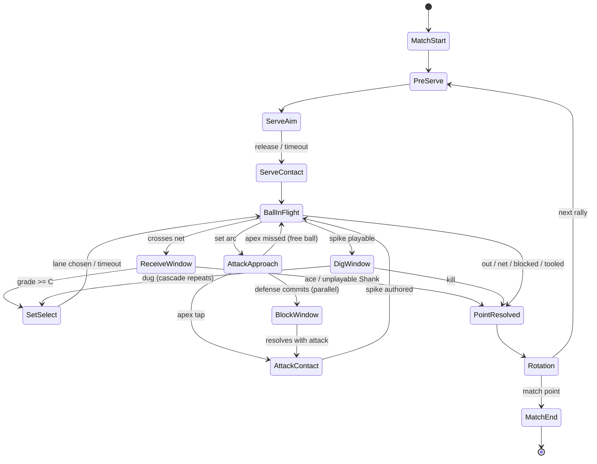

# M0 Gameplay Spec — Grey-Box Feel Prototype

Scope: rally simulation, contact resolution, aim, camera, AI, input, and the M0 build/gate plan. Consistent with PLAN.md §2. Non-goals: meta systems, economy, story, art.

Conventions used throughout:

- All gameplay math consumes stats **normalized to 0..1** (raw→normalized mapping is owned by the meta layer; M0 hardcodes test values).
- Timing grades: **Perfect / Great / Good / Miss**. Contact quality: continuous **[0,1]**. Receive display grades: **S/A/B/C/Shank**.
- Quality cascade: receive grade → set options available → set grade → spike window size → point resolution.
- Sim runs at a **fixed timestep of 1/60 s** [structural]; rendering interpolates. All rally resolution is pure C# with injected seeded RNG (`IRng` injected at sim construction); RNG is consumed **only** at the points explicitly marked ⚄ in this doc. Everything else is deterministic. Replays = initial state + seed + input log.
- Every constant is labeled **[tunable]** (prototype will move it) or **[structural]** (load-bearing design).

---

## 1. Rally State Machine

One state machine per rally, owned by `RallySim`. The defending side's Block/Dig windows are modeled as states of the same machine (only one ball; exactly one side owns the active contact at any time — contact-based control).

### 1.1 States

| State | Owner side | Description |
|---|---|---|
| `MatchStart` | — | Lineup validation, coin flip for first serve ⚄ (seeded). |
| `PreServe` | Serving | Rotation/legality check, libero auto-swap, camera settles. Presentation only. |
| `ServeAim` | Serving | Drag-aim + hold-release power meter live. |
| `ServeContact` | Serving | Instantaneous: evaluate timing grade at release, compute serve quality, author trajectory. |
| `BallInFlight` | — | Trajectory playback (§2). Re-entered after every contact. Emits plane-crossing events. |
| `ReceiveWindow` | Receiving | Commit tap selects receiver; timed tap on ball arrival. Also handles free balls. |
| `SetSelect` | In-possession | Time-dilated attacker-lane choice (options gated by receive grade). |
| `AttackApproach` | Attacking | Spiker approach animation; apex timing window arms near apex. Defense may enter `BlockWindow` during this state. |
| `AttackContact` | Attacking | Timed tap + swipe aim at apex. |
| `BlockWindow` | Defending | Read-or-commit choice + timed jump tap + hand-position swipe. Opens during `AttackApproach`, resolves at `AttackContact`. |
| `DigWindow` | Defending | Timed tap on spike arrival if ball passes/deflects off block. |
| `PointResolved` | — | Outcome from §3.6, score + Hype updates, kill replay presentation. |
| `Rotation` | — | Sideout rotation on serve win, libero auto-swap, front/back legality recompute. |
| `MatchEnd` | — | First to 11 (quick) / 15 (story) / 25 (finale), win by 2 [structural]. M0 uses first to 11. |

### 1.2 Transition table

| # | From | To | Trigger | Timer / timeout behavior |
|---|---|---|---|---|
| T1 | `MatchStart` | `PreServe` | lineups valid | — |
| T2 | `PreServe` | `ServeAim` | presentation done | 1.0 s [tunable] |
| T3 | `ServeAim` | `ServeContact` | player releases hold | timeout 8 s [tunable] → auto-serve at current meter value, grade capped Good |
| T4 | `ServeContact` | `BallInFlight` | trajectory authored | instantaneous |
| T5 | `BallInFlight` | `ReceiveWindow` | ball crosses net plane toward receiving side | window opens at net-cross; landing indicator shrinks until arrival |
| T6 | `ReceiveWindow` | `SetSelect` | receive grade ≥ C | receive tap evaluated at ball-arrival tick |
| T7 | `ReceiveWindow` | `PointResolved` | Shank with unplayable quality (§3.3) or no commit before arrival | no-commit = ace |
| T8 | `SetSelect` | `BallInFlight` | lane chosen (or timeout) | 2.5 s real-time at 0.3× time dilation [tunable]; timeout → auto high-outside, set grade capped Good |
| T9 | `BallInFlight` | `AttackApproach` | set arc ascending; spiker begins approach | approach duration = set arc duration (§2.3) |
| T10 | `AttackApproach` | `AttackContact` | attacker tap inside spike window, or apex passed | apex passed with no tap → Miss (free ball over, §3.6 case E) |
| T11 | `AttackApproach` | `BlockWindow` (defense) | defense commit input, or AI block decision tick | parallel entry; does not leave `AttackApproach` |
| T12 | `AttackContact` (+`BlockWindow` resolution) | `BallInFlight` | spike trajectory authored; block engagement computed (§3.6) | instantaneous |
| T13 | `BallInFlight` | `DigWindow` | spike/deflection heading to defending court, not terminal | — |
| T14 | `DigWindow` | `SetSelect` | dig success (§3.6) — dig quality maps to receive grade, cascade repeats | rally continues; contact count resets |
| T15 | `BallInFlight` / `DigWindow` | `PointResolved` | terminal outcome: kill, blocked, tooled, out, net | — |
| T16 | `PointResolved` | `Rotation` | score applied | 1.5 s presentation [tunable] |
| T17 | `Rotation` | `PreServe` | rotation applied | 0.8 s [tunable] |
| T18 | `Rotation` | `MatchEnd` | match point reached | — |

Free-ball rule [structural]: any non-terminal Miss (set Miss, weak receive over) authors a `FreeBall` arc to the opponent → T5 (`ReceiveWindow`) with a +1 display-grade bonus to the receiver (easy ball).

### 1.3 Interrupt rules

- **Signature-move activation** [structural]: may be requested only while the activating character owns the upcoming contact and its state is one of `ServeAim`, `ReceiveWindow`, `SetSelect`, `AttackApproach`, `BlockWindow`, and team Hype ≥ move cost. On activation: sim clock **pauses**, 1–2 s cut-in plays (camera §5), Hype is spent, the move's mechanical primitives (contract list a–f) are applied as modifiers to the pending contact(s), sim resumes at the exact paused tick. One activation per side per rally state; simultaneous requests resolve attacker-first [tunable]. M0 stubs exactly two moves: one primitive-(a) guaranteed-Perfect spike, one primitive-(c) trajectory-override serve.
- **Ignition onset**: when team Hype crosses threshold 100 → team enters Ignition (contract: per-team 0–100). Presentation overlay + 0.3 s hit-stop [tunable]; **never** changes rally state, never pauses input windows beyond the hit-stop (windows shift by the hit-stop duration so no input is stolen).
- Pause menu: freezes sim clock; on resume, any open input window restarts from its opening tick [structural] (prevents pause-scumming timing: the window is re-armed, not extended).

### 1.4 State diagram



(Signature cut-in is a clock-pause overlay on the five ownable states; Ignition is a non-blocking overlay — both omitted from the diagram for legibility.)

---

## 2. Ball Trajectory Model

### 2.1 Approach: authored kinematic arcs, not a physics sim [structural]

Every contact **authors** a parametric arc; the ball then plays it back. No rigidbody, no collision response solver.

Rationale: (1) **determinism** — identical inputs + seed reproduce the rally bit-for-bit on any device; (2) **designer control** — apex height and hang time are direct tuning knobs, so "the set hangs long enough to read the block" is a number, not an emergent accident; (3) **testability** — arcs are pure functions, EditMode-testable without the engine; (4) **future server-side replay** — the deterministic core moves behind a transport unchanged (PLAN.md §5.3).

### 2.2 Parameterization

An arc is a **piecewise quadratic Bézier in the vertical plane + linear ground track**:

- Ground track: `p_xz(u) = lerp(start_xz, end_xz, u)`, `u = t / T` (optionally eased for float serves, below).
- Height: two quadratic Bézier segments joined at the authored apex `(u_apex, h_apex)` with C1 continuity; endpoints `h_start` (contact height) and `h_end` (target height: 0 for floor, net-clearance for crossing checks).
- Duration `T` authored per contact type; horizontal speed is a *consequence* of `T` and distance, clamped to `v_max = 30 m/s` [tunable] (spikes shorten `T` to the clamp).

Arc struct: `{start, end, h_apex, u_apex, T, ease, wobble_seed?}` — 7 numbers + flags; trivially serializable for replays.

### 2.3 Per-contact-type parameters

Court: 18 m × 9 m, net height 2.24 m (co-ed compromise) [tunable].

| Contact type | `T` (s) | `h_apex` (m) | `u_apex` | Ease / special |
|---|---|---|---|---|
| Serve — float | 1.3 [tunable] | 3.4 [tunable] | 0.45 | lateral wobble: `±sin`-noise offset up to 0.5 m [tunable], phase from seeded RNG ⚄, sampled at author time (deterministic playback) |
| Serve — jump | 0.9 [tunable] | 3.0 [tunable] | 0.35 | none; flatter, faster |
| Pass / receive | 1.6 [tunable] | 4.5 [tunable] | 0.5 | quality < 0.45 pulls `end` off-target (§3.3) |
| Set — high | 1.8 [tunable] | 6.0 [tunable] | 0.5 | long hang [structural: readability] |
| Set — quick | 0.7 [tunable] | 3.2 [tunable] | 0.5 | tight window by design |
| Spike | dist/`v`, `v` = lerp(14, 26 m/s, quality) [tunable] | shallow: `h_apex` = contact height, `u_apex` = 0 (monotonic descent) | — | contact height = 2.6 + 0.9 × Jump m [tunable] |
| Roll shot | 1.1 [tunable] | 3.6 [tunable] | 0.4 | soft arc over block to mid-court |
| Block deflection | 0.5–0.9 | 2.8 [tunable] | 0.3 | direction: reflected incoming ±15° jitter ⚄ (seeded); T from remaining energy `(1 − B)` (§3.6) |
| Free ball | 2.0 [tunable] | 5.0 [tunable] | 0.5 | always mid-court target |

### 2.4 Net / antenna / bounds interaction [structural]

Checked analytically at author time (no runtime collision):

- **Net**: arc height at net-plane crossing `< 2.24 + 0.02 m` margin → contact resolves as **net** (terminal) — except serve/spike arcs within `[net_h − 0.04, net_h + 0.02]` become a **net-cord roll**: re-authored short arc to a random-side ⚄ landing within 1 m of the net (seeded; the one "drama" RNG, always visible).
- **Antenna**: ground track crossing the net plane outside x ∈ [0, 9] m → **out** (terminal).
- **Bounds**: `end` outside the 9×9 opponent half → **out** unless a block touch occurred (then tooled, §3.6). Landing on a line = in.
- Ceiling: none in M0 grey-box.

### 2.5 Determinism plumbing

- `RallySim.Tick(input)` advances exactly one fixed step (1/60 s); no wall-clock reads inside the sim [structural].
- Seeded RNG injection points (complete list): match coin flip; float-serve wobble phase; block-deflection jitter; net-cord side; AI timing-grade sampling (§6.2); AI utility tie-breaks (§6.1). **Nothing else consumes RNG.**
- Slow-mo/time dilation is presentation-layer only: it scales render/​input-sampling time, and input timestamps are converted back to sim ticks before evaluation [structural].

---

## 3. Contact Resolution Math v1

### 3.1 Timing windows

Each timed contact has an ideal tick `t*` (ball arrival / apex / release-sweet-spot). Player input at `t` gives `Δ = |t − t*|` in ms. Grade = smallest window containing Δ:

```
W_grade(contact) = base_ms[grade] × (1 + k_stat × stat_c) × ctx × assist
```

| Constant | Value | Label |
|---|---|---|
| `base_ms` Perfect / Great / Good | 40 / 90 / 150 ms | [tunable] |
| `k_stat` (window widening per stat point) | 0.5 | [tunable] |
| `ctx` | context multiplier: spike ← set-grade table §3.5; serve ← aim-risk §4.2; quick set attack ×0.8 [tunable]; else 1.0 | — |
| `assist` | accessibility widen, §7.4 | — |

`stat_c` = mean of the contact's governing stats (normalized 0..1) [structural]:

| Contact | Governing stats |
|---|---|
| Serve | Serve, Power |
| Receive / Dig | Receive, Speed |
| Set | Technique |
| Spike | Power, Jump |
| Block | Jump, Technique |

Beyond `W_Good` → **Miss**. (Stamina, if M1 keeps it, multiplies `base_ms` late in a match; all M0 math is written assuming its absence [structural].)

### 3.2 Quality formula [structural]

```
quality = floor(stats) + grade_coefficient × (ceiling(stats) − floor(stats))

floor(stats)   = 0.15 + 0.35 × stat_c      // 0.15 .. 0.50   [tunable]
ceiling(stats) = 0.55 + 0.45 × stat_c      // 0.55 .. 1.00   [tunable]
grade_coefficient: Perfect = 1.0, Great = 0.7, Good = 0.4, Miss = 0.0   [tunable]
```

quality ∈ [0,1] always. Stats raise floor and ceiling and widen windows (§3.1); they never remove the input (PLAN.md pillar 2). Signature primitive (f) (+X% team quality buff) multiplies the final quality, clamped to 1.

### 3.3 Receive display grades and error handling

Receive/dig quality maps to display grade [tunable thresholds]:

| Grade | quality q |
|---|---|
| S | q ≥ 0.85 |
| A | 0.65 ≤ q < 0.85 |
| B | 0.45 ≤ q < 0.65 |
| C | 0.25 ≤ q < 0.45 |
| Shank | q < 0.25 |

Shank sub-rule [structural]: `0.10 ≤ q < 0.25` → playable Shank (desperation ball, §3.4); `q < 0.10` → unplayable, point over (T7). Receive Miss grade ⇒ quality = floor(stats) only if a commit tap occurred; **no commit at all ⇒ ace**. Pass arcs with q < 0.45 offset the arc `end` by `(0.45 − q) × 6 m` [tunable] toward off-target — the setter visibly chases bad passes.

### 3.4 Receive grade → set options matrix [structural]

| Receive grade | quick | high-outside | back-row-pipe | dump |
|---|---|---|---|---|
| S | ✓ | ✓ | ✓ | ✓ |
| A | ✓ | ✓ | ✓ | — |
| B | — | ✓ | ✓ | — |
| C | — | ✓ | — | — |
| Shank (playable) | — | ✓ (set grade capped **Good**) | — | — |

The MC is the team's setter [structural, contract]: `SetSelect` is the MC's court-vision moment; option gating is diegetic.

### 3.5 Set grade → spike window scaling [structural]

`ctx` multiplier applied to all three spike window widths:

| Set grade | spike window ctx |
|---|---|
| Perfect | ×1.25 [tunable] |
| Great | ×1.00 |
| Good | ×0.75 [tunable] |
| Miss | no spike — free ball over (T-free-ball) |

### 3.6 Point resolution [structural pipeline, tunable constants]

Inputs: spike quality `q_s`, aim zone `z` (§4), block state (committed column, block quality `q_b`, commit type), dig quality `q_d` (if attempted). Evaluate **in order**; first terminal wins. No RNG.

```
A  = q_s × (0.75 + 0.25 × risk(z))            // attack power; risk(z) §4.2   [tunable]
B  = q_b × match(z)                           // block strength
match(z): committed column == zone column → 1.0; adjacent column → 0.35; else 0.0   [tunable]
read-commit (waited for set) → q_b × 0.85; early-commit correct → ×1.15; early wrong → match = 0   [tunable]
```

| Step | Condition | Outcome |
|---|---|---|
| 1 | spike timing = Miss | **free ball** over (rally continues) |
| 2 | `q_s < 0.08` [tunable] | **net** — point to defense |
| 3 | aim zone is edge zone (§4.1) AND `q_s < 0.30 − 0.10 × risk_discount` where `risk_discount` = 1 if timing = Perfect else 0 [tunable] | **out** — point to defense |
| 4 | `B − A ≥ 0.15` [tunable] | **blocked** (stuff) — point to defense |
| 5 | `A − B ≥ 0.25` [tunable] AND `B > 0` AND z is edge zone | **tooled** — point to attack |
| 6 | `B > 0` (touch, non-terminal) | deflection arc ⚄ (§2.3); `A_eff = A × (1 − 0.5 × B)` [tunable] → step 7 |
| 7 | dig attempted: `q_d ≥ 0.25 + 0.55 × A_eff` [tunable] | **dug** — rally continues; dig display grade from margin `q_d − req` mapped via §3.3 table |
| 8 | otherwise | **kill** — point to attack |

Serve resolution reuses the same pipeline with `B = 0` and receive as the "dig": ace = step 8, service error = steps 2–3.

### 3.7 Hype accrual [tunable table]

Per contract: per-team 0–100; threshold 100 → Ignition; signature moves spend Hype.

| Event | Hype (team) |
|---|---|
| Perfect contact | +4 |
| Kill | +10 |
| Stuff block | +14 |
| Ace | +14 |
| Rally ≥ 6 contacts, per extra contact | +2 both teams |
| Dug an `A ≥ 0.8` spike | +8 |
| Own error (net/out) | −6 |

Ignition semantics [structural, decided at VB-9]: Ignition **latches** when a team's Hype first reaches 100 and persists for the rest of the match; spending Hype on signatures never revokes it — activation gates on "Hype ≥ move cost" (§1.3), not on Ignition.

---

## 4. Aim Model

### 4.1 Court zone grid [structural — refine only if playtest demands]

Each 9×9 m half is a **3×3 zone grid**: columns L/C/R (left/center/right from the attacking side's view), rows F/M/B (front/mid/back). Zones named `z_LF … z_RB`. **Edge zones** = the 8 non-center zones; **corner/line zones** (`z_LF, z_RF, z_LB, z_RB` + any zone whose boundary is a court line) carry `risk(z) = 1.0`; mid-edge zones 0.6; center zone `z_CM` risk 0.2 [tunable]. Aim always resolves to a zone center ± quality-scaled scatter: `offset = (1 − quality) × 1.5 m` [tunable] toward court center (bad contacts drift safe, not out — errors come from §3.6 thresholds, keeping outcomes readable).

### 4.2 Serve: drag-aim + hold-release

- Drag places a target reticle on the opponent grid (snaps to zone, free within zone). Hold-release power meter: release in sweet band = timing eval (§3.1).
- Risk/reward [structural]: let `d` = distance (m) from reticle to nearest boundary line. Timing window multiplier `ctx = clamp(0.6 + 0.4 × d / 1.0, 0.6, 1.0)` [tunable] — aiming within 1 m of a line shrinks all serve windows up to 40%. Reward flows through `risk(z)` in the attack-power formula (§3.6) — line serves that land are materially harder to receive.
- Float vs jump serve is a pre-serve toggle (jump serve: +0.15 flat to `q_s` after clamp, all windows ×0.8) [tunable].

### 4.3 Spike: swipe → zone mapping [structural]

Swipe evaluated at `AttackContact`; direction relative to screen-up (portrait) / court-forward (landscape):

| Gesture | Shot | Target zone |
|---|---|---|
| Swipe straight ahead | **line** | same-column back edge zone (`z_XB`, X = attacker column) |
| Swipe diagonal (≥ 25° [tunable]) | **cross** | opposite-corner back zone |
| Short swipe (< 40% of min swipe length § 7.2) upward | **roll** | `z_CM` (over the block, soft arc §2.3) |
| Tap (no swipe) during spike window | **feint/dump** | front zone behind blocker's column |

### 4.4 Block: hand-position swipe

During `BlockWindow`: swipe L/C/R sets hand column (the `match(z)` column in §3.6); tap timing at attack contact grades the jump (`q_b` via §3.2). Holding the swipe ≥ 0.4 s before the set resolves = **early commit**; swiping after set release = **read** (§3.6 modifiers). No swipe = no block, `B = 0`.

---

## 5. Camera Shot List

Camera director drives Cinemachine vcams; both rigs implemented for the M0 A/B (PLAN.md §2.5). Slow-mo factors are presentation-only time dilation (§2.5 plumbing). All durations [tunable].

**Default framing [structural]: behind-baseline** of the player's team — the "watching your side from the bench" anchor shot; portrait frames the 9 m court width natively.

| # | Contact / moment | Trigger | Portrait rig shot | Landscape rig shot | Duration | Slow-mo |
|---|---|---|---|---|---|---|
| C1 | PreServe / default | state entry | behind-baseline, slight high angle, full court depth | behind-baseline ¾, court diagonal | persistent | 1.0 |
| C2 | ServeAim | `ServeAim` entry | over-shoulder of server, reticle on far court | side-on server medium, reticle inset | state length | 1.0 |
| C3 | Serve contact | release | punch-in on toss contact, snap back to C1 | whip-pan following ball | 0.4 s | 0.7 [tunable] |
| C4 | ReceiveWindow | net cross | C1 with landing-indicator emphasis (no cut — readability) | low side-on, receiver foreground | until contact | 1.0 |
| C5 | SetSelect | state entry | slight push-in on MC (setter), lane icons overlay | same, wider | state length | 0.3 (design dilation §1.2 T8) |
| C6 | AttackApproach | approach start | rise with spiker, ball upper-third | side-on low angle tracking approach | approach length | 1.0 |
| C7 | Spike contact | `AttackContact` eval | **punch-in at apex, 15° dutch** [tunable] | **side-on low wide — the poster shot** | 0.25–0.40 s | 0.25 [tunable] — the signature sensation |
| C8 | Block resolution | steps 4–6 §3.6 | net-cam looking down the net line | net-cam, slightly elevated | 0.3 s | 0.4 [tunable] |
| C9 | Dig | `DigWindow` contact | fast cut to low behind-diggers | tracking low lateral | 0.3 s | 0.6 [tunable] |
| C10 | PointResolved (kill) | terminal outcome | floor-slam decal close-up → score overlay | same | 1.5 s | 0.5 first 0.4 s |
| C11 | Signature cut-in | interrupt §1.3 | **full-screen 2D cut-in, both rigs** [structural — gacha showcase] | same | 1–2 s (clock paused) | n/a |
| C12 | Ignition onset | Hype = 100 | vignette + saturation push on C1, no cut | same | 0.3 s hit-stop | overlay only |

Cut-in insertion points: C11 may interrupt exactly at the five ownable states (§1.3); the director stacks the return-shot so the post-cut-in camera is the state's normal shot (no re-establishing cut).

Rule [structural]: never cut during an open input window except C7's pre-authored punch-in (which tracks the contact point, preserving tap-target continuity).

---

## 6. AI Spec

### 6.1 Per-contact utility scoring

At each AI decision (serve target, set-option choice, spike zone, block commit/read), score every legal action:

```
U(a) = Σ_i w_i × x_i(a)      → pick argmax; ties broken by seeded RNG ⚄
```

Inputs `x_i` (all normalized 0..1):

| Input | Definition |
|---|---|
| `x_matchup` | attacker's governing `stat_c` − best defender's blocking `stat_c` vs. this action, remapped to 0..1 |
| `x_score` | score pressure: `(opp_score − own_score + 5) / 10` clamped — behind = aggressive |
| `x_hype` | own team Hype / 100 |
| `x_rally` | min(rally contact count / 10, 1) — long rallies favor safe resets |
| `x_lit` | 1 if action is a lit set option (§3.4) at full grade potential, else penalized by the cap |
| `x_surprise` | 1 − (uses of this action ÷ actions so far this match) — anti-repetition |

Weight tables per difficulty tier [all tunable]:

| Weight | Easy | Normal | Hard |
|---|---|---|---|
| `w_matchup` | 0.2 | 0.4 | 0.6 |
| `w_score` | 0.1 | 0.2 | 0.3 |
| `w_hype` | 0.0 | 0.1 | 0.2 |
| `w_rally` | 0.3 | 0.2 | 0.1 |
| `w_lit` | 0.4 | 0.4 | 0.4 |
| `w_surprise` | 0.0 | 0.2 | 0.4 |

### 6.2 Timing execution: grade-probability distributions

AI never "taps" — it samples its timing grade directly from a per-tier distribution ⚄ (seeded RNG; the sampled grade then feeds §3.2 exactly like a player grade):

| Tier | P(Perfect) | P(Great) | P(Good) | P(Miss) |
|---|---|---|---|---|
| Easy | 0.10 | 0.30 | 0.40 | 0.20 |
| Normal | 0.25 | 0.40 | 0.25 | 0.10 |
| Hard | 0.45 | 0.35 | 0.15 | 0.05 |

All [tunable]. Story rubber-banding (M1+, disclosed per PLAN.md §2.6) shifts these ±one column; not in M0.

M0 note [v0, decided at MatchSim]: AI-sampled grades bypass §3.5's set-grade→spike-window ctx (the AI has no windows to scale). Symmetric across both sides, so mirror-match validity holds; M1 revisits via a grade-distribution shift keyed to set grade.

### 6.3 Tactic vocabulary per tier [structural]

| Tier | Serve | Set options used | Block behavior |
|---|---|---|---|
| Easy | center-zone float only | high-outside only | read only, center column |
| Normal | + line float serves, corner targets | + quick | read + occasional commit (via `U`) |
| Hard | + jump serve, targets weakest receiver (`min Receive stat`) | + back-row-pipe, + dump | full read/commit mix, adjacent-column soft commits |

### 6.4 Hard rule [structural]

Difficulty NEVER adds player input latency, shrinks player windows, or alters player-side math in any way. Difficulty lives exclusively in §6.1–6.3 (AI decision quality, AI execution, AI vocabulary).

---

## 7. Input Spec

### 7.1 Gesture inventory

| Gesture | Definition | Used by |
|---|---|---|
| Tap | down+up < 150 ms [tunable], travel < 24 px [tunable] | receive commit & timing, spike timing, block jump, feint |
| Hold-release | down ≥ 150 ms, release = event | serve power meter |
| Swipe | travel ≥ 60 px [tunable] within 250 ms | spike aim, block hand column |
| Drag | down + continuous move, no release requirement | serve reticle aim |

All thresholds in density-independent px at 160 dpi reference [structural].

### 7.2 Buffering & timestamping [structural]

- Input timestamps captured on the input thread at touch-down, converted to sim ticks (through any active time dilation, §2.5) before evaluation — input→evaluation is dilation-invariant.
- **Buffer window: 100 ms [tunable]** — a timing tap landing up to 100 ms *before* a window opens is latched and evaluated as `Δ = t_open − t` against the same grade table. Prevents "ate my input" at window boundaries.
- One evaluation per window: first qualifying gesture wins; later inputs in the same window ignored (no re-tap penalty [structural — forgiving by default]).

### 7.3 Mis-input forgiveness

- Swipe with travel < 60 px but ≥ 24 px: resolved as **tap** for timing, **no aim change** (spike defaults to cross [tunable default]).
- Double-tap within 80 ms [tunable]: second tap discarded.
- Drag released accidentally during `ServeAim` with meter < 10%: not a serve; meter resets once, one time per serve [tunable].
- Swipe direction within ±10° of a boundary between two shot mappings [tunable]: resolves toward the safer shot (cross over line).

### 7.4 Accessibility — assist mode [structural]

Global option, off by default: **timing-window widen +0% / +25% / +50%** [tunable steps], applied as the `assist` multiplier in §3.1 to *player* windows only. Flagged on score screens for leaderboard-adjacent modes (M1+ decision); never affects AI. Also included in M0: reduce-slow-mo toggle (caps dilation at 0.7) for vestibular comfort.

---

## 8. M0 Build Order & Feel Gate

### 8.1 Scene inventory

| Scene | Contents |
|---|---|
| `Court_GreyBox` | 18×9 m court plane, net + antenna quads, line decals, zone-grid debug overlay, capsule players (6v6, team-tinted, libero off-tint), ball sphere, landing indicator |
| `Rig_Portrait` | Cinemachine vcam set §5 portrait column |
| `Rig_Landscape` | Cinemachine vcam set §5 landscape column |
| `Test_RallySandbox` | scripted-rally harness: injects input logs into `RallySim` for EditMode/PlayMode tests and replay playback |

### 8.2 Task sequence (2-week blocks)

| Block | Deliverable | Exit check |
|---|---|---|
| **W1–2** | Deterministic core: fixed-timestep `RallySim`, arc library (§2), seeded `IRng`, serve→receive loop playable, EditMode tests for §3.1–3.3 math | replay of a logged serve+receive reproduces identical state hash |
| **W3–4** | Full contact chain: SetSelect, spike, block, dig; §3.4–3.6 pipeline; free-ball paths; Hype accrual counter (no Ignition VFX) | scripted 10-contact rally resolves per hand-computed §3.6 table |
| **W5–6** | AI tiers v0 (§6), camera director v1 + slow-mo on portrait rig, input spec §7 incl. buffering + assist | full rally vs Normal AI, blindfold check: Easy vs Hard distinguishable |
| **W7–8** | Landscape rig, A/B harness, tuning pass on all [tunable] constants, feel-gate playtests, signature-move interrupt stubs (§1.3) | gate protocol §8.3 executed and logged |

### 8.3 The feel gate, operationalized [structural]

All four checks must pass; any failure → iterate within M0 (PLAN.md §6: hard wall).

1. **Median rally length band**: across 50 consecutive rallies vs Normal AI (3 testers pooled), median contacts per rally ∈ **[4, 9]** [tunable band]. Below = serves/spikes too terminal; above = attacks toothless.
2. **Input→feedback latency ≤ 50 ms at 60 fps**: touch-down → first visible/audible response frame, measured by 240 fps camera capture on mid-tier device (or Unity frame-timing markers ±1 frame), sampled 20× per gesture type. All gesture types must pass.
3. **Portrait-vs-landscape A/B decision**: 5 testers × both rigs × 15-rally sessions (order counterbalanced). Score each rig: readability of set options (5-pt), spike-aim confidence (5-pt), one-hand comfort (portrait only), stated preference. Landscape must win by ≥ 1.0 mean composite to overturn the portrait default; **portrait wins ties** (PLAN.md §2.5).
4. **"10 consecutive fun rallies" protocol**: tester plays vs Normal AI; after every rally, rates tension 1–5 before the next serve. Pass = a run of **10 consecutive rallies rated ≥ 4** within a 30-rally session, achieved by **2 of 3 testers**. Any rally the tester can't explain *why* they lost invalidates the run (readability failure, logged with replay seed).

Instrumentation shipped in M0 [structural]: per-rally log line `{seed, contacts, grades[], qualities[], outcome, duration}` — feeds checks 1 and 4 and every future balance conversation.
