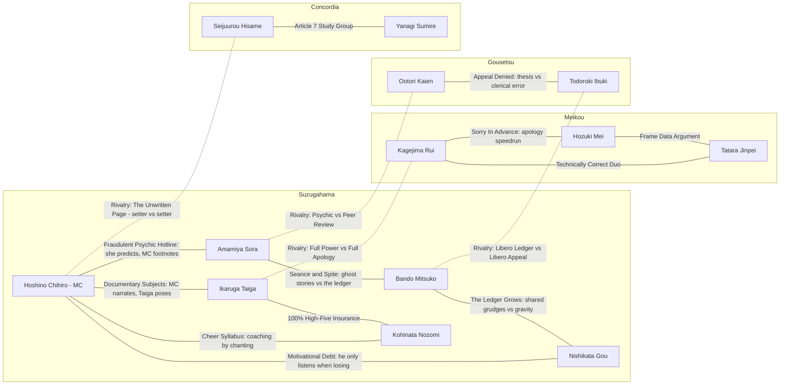

# Story Bible — Arc 1, Roster, Banners

Wave-2 planning doc. Owns: tone, world, MC, arc 1 outline, 12-character gacha roster + MC, bond graph, banner order, VN production notes. Defers all economy numbers to `docs/economy-progression.md` and all data shapes to `docs/data-schemas.md`. Gameplay math references contract primitives only (`docs/m0-gameplay-spec.md`).

**Tone directive:** comedy-forward sports parody in a co-ed league. Absurd institutions played straight; tongue-in-cheek melodrama; gag characters who are mechanically real. Every sports-anime trope turned up until it becomes funny — but the volleyball itself is always sincere. The comedy lives in the world and cast, never in mocking the player's effort.

---

## 1. World & League

### 1.1 The town: Suzugahama

Seaside town, pop. 31,000. Its economy is 40% volleyball tourism due to a 1988 travel brochure misprint ("famous for volleyball" was supposed to read "famous for volcanic sand"). The town leaned in rather than issue a correction. There is a bronze statue of a libero nobody can identify. Everyone treats this as normal.

### 1.2 The club: Suzugahama Municipal High School VC

Co-ed by accident, sincere by choice: budget cuts merged the boys' and girls' volleyball clubs in 2019 and nobody ever filed the separation paperwork. When challenged, the league ruled that *"a team is six persons"* and refused to elaborate. The club practices in a gym it shares with the calligraphy club (net stays up; calligraphy club has adapted; their brushwork is now very fast).

### 1.3 The league: the All-Prefecture Co-Educational Volleyball Concordance (APCVC), "the Concord"

Founded 1974 to settle a feud between two mayors over a parking lot. Its bylaws run 900 pages; no living person has read Article 7, which is nonetheless cited constantly and always upheld. Structure (played completely straight):

| Tier | Name | Format |
|---|---|---|
| Regional | Suzugahama Coastal Bloc Qualifiers | Round-robin, matches **first to 11** (quick) |
| Prefectural | The Concordance Invitational | Bracket, matches **first to 15** (story) |
| Finals | The Sitting of the Concord | Single final, **first to 25** (finale), held in a courtroom-shaped arena |

Referees are called *Arbiters* and wear judicial sashes. Trophies are notarized.

### 1.4 Naming conventions

Anime-JP flavor, romanized, surname-first in dialogue, given-name display in UI. Schools named like institutions with one absurd load-bearing detail. Signature moves get shouted names (comedic text, sincere execution).

### 1.5 Tone do / don't

| DO | DON'T |
|---|---|
| Rival school funded entirely by a misunderstanding, administered with total seriousness | Undercut a climax rally with a gag — final points are always played sincere |
| Characters aware their tropes are tropes, committed to them anyway | Characters who don't care about volleyball — everyone's love of the sport is real |
| Bureaucratic absurdity (Article 7, notarized trophies) as running texture | Jokes that mock the player's skill, losses, or pulls |
| Melodrama delivered at 110% then immediately deflated *after* the point ends | Fourth-wall breaks during rallies (menus/VN scenes only) |
| Gag characters who are mechanically real picks | "Joke" units that are mechanically useless |
| Co-ed treated as unremarkable in-world | Making the co-ed league itself the punchline |

---

## 2. MC — Hoshino Chihiro

| Field | Value |
|---|---|
| Role | **Setter (S)** — contract-pinned. Diegetic: set-selection gameplay = MC's court vision |
| Name | Hoshino Chihiro (default; player-renamable; gender-neutral presentation, player-selected pronouns) |
| Playstyle tag | Technique |
| Background | Transfer student; spent middle school as team scorekeeper after a tryout injury, and learned to see the whole court from the bench. First practice at Suzugahama, called three plays out loud before realizing they weren't the coach. |
| Comedic flaw | Narrates court vision aloud like a nature documentary ("...and here we observe the middle blocker, committing early..."). Opponents can hear them. It has never once helped. |
| Why not in gacha (narrative) | The club tried printing MC scratch cards as a fundraiser; the Concord banned self-acquisition under Article 7. Diegetically: **you can't pull yourself.** |
| Growth | Daily training minigames only (PLAN §3.2) — the F2P emotional anchor. |
| Signature move | **"Documentary Vision"** — primitive **(b)**: timing-window widen +X% for N team contacts **[tunable]** |
| Passive | *Scorekeeper's Eye* — set-selection timer slows slightly more during Ignition **[tunable]** |
| Base pips (Pow/Jmp/Tec/Srv/Rcv/Spd) | 2/3/5/3/3/3 **[tunable]** |

**Self-insert balance notes:** flaw is externalized (narration) so the player laughs *near* MC, not *at* their play. MC never fails in cutscenes for comedy — comedy comes from the world reacting to MC. Dialogue choices are flavor-only in arc 1 **[structural]**. MC's stats grow slower but permanently (dailies), so the roster carries early power and MC carries identity.

---

## 3. Arc 1 Outline — "The Concordance" (3 acts, 25 story matches)

Mechanics introduced (contract order): serve aim, receive commit, set selection, quick attacks, blocking reads, Hype/Ignition, signature moves, equipment intro, rotations. Match count 25 **[structural]** (PLAN §3.4). Difficulty beat: 1 (tutorial) → 5 (finale wall).

### Act 1 — "Six Persons" (matches 1–8): form the team, win the Coastal Bloc

| # | Opponent | Stakes | Gag premise | Mechanic introduced | Diff |
|---|---|---|---|---|---|
| 1 | Suzugahama 3rd-years (intrasquad) | Join the club | Tryout is a single rally; the 3rd-years all retired last week but showed up anyway out of habit | Serve aim | 1 |
| 2 | Suzugahama Calligraphy Club | Keep the gym | Calligraphy club invokes gym-rights via Article 7; they are shockingly competent | Receive commit | 1 |
| 3 | Hamaguri Fisheries HS | Bloc opener | Their whole rotation smells of the morning catch; crowd is 90% seagulls | Set selection | 1 |
| 4 | Suzugahama Middle School | Charity exhibition | The middle schoolers trash-talk in perfect keigo | Quick attacks | 2 |
| 5 | Tozan Alpine Academy | Bloc round 2 | School is on a mountain; team trains at altitude; they are dizzy at sea level | Blocking reads | 2 |
| 6 | Meikou Gakuen B-team | Scout ambush | Meikou's B-team is sent to film Suzugahama; forgets to press record | Hype meter / Ignition | 2 |
| 7 | Yotsuya Commerce HS | Bloc semifinal | Team sells merch of themselves courtside mid-match | Rotations (auto-rotation, libero auto-swap surfaced in HUD) | 3 |
| 8 | **Meikou Gakuen (Kagejima Rui)** — ACT 1 CLIMAX | Bloc final; Invitational berth | Meikou is funded entirely by a misunderstanding (billionaire endowed the wrong school; everyone too polite to mention it); facilities absurd, hearts sincere | Signature moves | 3 |

**Act 1 climax rival = Kagejima Rui (SSR)** → her banner opens on clear.

### Act 2 — "The Wall Syllabus" (matches 9–17): training camp + Invitational vs the blocking school

| # | Opponent | Stakes | Gag premise | Mechanic introduced | Diff |
|---|---|---|---|---|---|
| 9 | Meikou Gakuen (rematch, friendly) | Training camp invite | Kagejima invites Suzugahama to Meikou's mistakenly-funded resort facility | Equipment intro (first Shoes/Kneepads drops) | 3 |
| 10 | Camp drill: Gousetsu 2nd-years | Camp ranking | Gousetsu students are at camp "on a field study of being blocked" | Equipment set bonuses surfaced | 3 |
| 11 | Kanaoka Girls' Academy | Invitational R1 | Traditional powerhouse scandalized to learn co-ed teams exist; adapts with terrifying speed | — (consolidation) | 3 |
| 12 | Denden Signal Tech HS | Invitational R2 | Team communicates entirely in train-station jingles | — | 3 |
| 13 | Ojika Island Combined School | Invitational R3 | Entire island's school-age population is exactly six persons; the Concord finds this "deeply elegant" | — | 4 |
| 14 | Gousetsu Institute (practice set) | Scouting the wall | Gousetsu teaches ONLY blocking; students major in Reading, minor in Commit | Blocking reads (advanced: read vs commit vs the quick) | 4 |
| 15 | St. Concordia B | Invitational quarterfinal | Concordia's B-team plays while a paralegal reads objections aloud | — | 4 |
| 16 | Hikawa Shrine HS | Invitational semifinal | Team blessed for victory so many times the blessings now conflict | — | 4 |
| 17 | **Gousetsu Institute of Blocking Sciences (Ootori Kaien)** — ACT 2 CLIMAX | Invitational final | The final exam of a school that teaches only blocking is: block Suzugahama | — (mastery test: full cascade vs an elite wall) | 4 |

**Act 2 climax rival = Ootori Kaien (SSR)** → his banner opens on clear.

### Act 3 — "The Sitting of the Concord" (matches 18–25): the finals, the founders' school

| # | Opponent | Stakes | Gag premise | Mechanic introduced | Diff |
|---|---|---|---|---|---|
| 18 | Meikou + Gousetsu mixed squad | Send-off exhibition | Beaten rivals form a joint "make sure our loss meant something" committee | — | 4 |
| 19 | Suzugahama OB/OG team | Town festival match | The unidentified libero statue's alleged model shows up; refuses to confirm | — | 4 |
| 20 | Concord Arbiters' Select | Seeding formality | The referees field a team; they call their own faults, tearfully | — | 4 |
| 21 | Kanaoka Girls' (rematch) | Finals R1 | Kanaoka has fully weaponized co-ed scouting reports in three weeks | — | 5 |
| 22 | Ojika Island (rematch) | Finals R2 | The island chartered a ferry; the crowd is the entire island | — | 5 |
| 23 | St. Concordia (Yanagi's squad) | Finals semifinal | Concordia files to have the match played "under Article 7 conditions"; nobody knows what changes; nothing visibly changes | — | 5 |
| 24 | St. Concordia Academy (full) — set 1 grudge match | Finale part 1 | Hisame reveals the family bylaws include a fifty-year plan with this match in it | — | 5 |
| 25 | **St. Concordia Academy (Seijuurou Hisame)** — ARC FINALE, first to 25 | The Sitting of the Concord | Setter vs setter: the bylaw heir vs the transfer who can't be pulled. All gags hold their breath — final rally is played dead sincere | — (everything, no assists) | 5 |

**Arc finale rival = Seijuurou Hisame (SSR)** → arc-capstone banner opens on clear.

---

## 4. Roster — 12 Gacha Characters + MC

Rarity distribution: **4 SSR / 5 SR / 3 R [structural]**. Co-ed: 6M / 6F gacha (+ MC, player-defined). Positions: S / OH / MB / OP / L all covered; 2 liberos; 1 rival setter (Hisame). All pips 1–5, order **Pow/Jmp/Tec/Srv/Rcv/Spd**, all **[tunable]**. Signature primitives per contract: (a) guaranteed timing grade one contact · (b) timing-window widen/shrink ±X% for N contacts · (c) trajectory override · (d) opponent block/dig quality debuff N contacts · (e) Hype gain/drain · (f) team quality buff +X% for N contacts. All X/N values **[tunable]**.

### Suzugahama Municipal (teammates)

| | Ikaruga Taiga |
|---|---|
| School / Pos / Tag / Rarity | Suzugahama · **OH** · Power · **SSR** |
| Gender | M |
| Personality gag | Does everything at 100% — spikes, high-fives (hospitalization-grade), whispering (audible from the parking lot) |
| Signature | **"YES!! FULL POWER!!"** — **(c)** trajectory override: flat laser spike arc + **(e)** Hype gain on kill |
| Passive | *No Half Speed* — own spike contacts gain bonus quality during Ignition **[tunable]** |
| Pips | 5/4/2/4/2/3 |
| Bonds | MC, Kohinata, Kagejima |

| | Amamiya Sora |
|---|---|
| School / Pos / Tag / Rarity | Suzugahama · **MB** · Quick · **SR** |
| Gender | F |
| Personality gag | Insists she's psychic; is actually just reading shoulders; her "predictions" are delivered as ghost stories |
| Signature | **"I Foresaw This (She Did Not)"** — **(a)** guaranteed Perfect for one block contact |
| Passive | *Cold Reading* — block read hints display slightly earlier **[tunable]** |
| Pips | 3/5/4/2/2/4 |
| Bonds | MC, Bando, Ootori |

| | Bando Mitsuko |
|---|---|
| School / Pos / Tag / Rarity | Suzugahama · **L** · Guts · **SR** |
| Gender | F |
| Personality gag | 148 cm of pure spite; dives for balls that are already dead; keeps a written ledger of every ball that has ever beaten her |
| Signature | **"REFUSE."** — **(a)** guaranteed Great for one receive contact + **(e)** Hype gain |
| Passive | *The Ledger* — receive display grade floor rises after each successful dig in a rally **[tunable]** |
| Pips | 1/2/3/1/5/5 |
| Bonds | Amamiya, Todoroki, Nishikata |

| | Nishikata Gou |
|---|---|
| School / Pos / Tag / Rarity | Suzugahama · **OP** · Power · **R** |
| Gender | M |
| Personality gag | Lefty opposite who is only motivated when losing; visibly bored at match point for |
| Signature | **"Finally, Stakes"** — **(e)** Hype gain, larger when own team trails **[tunable]** |
| Passive | *Comeback Clause* — small quality bonus while trailing **[tunable]** |
| Pips | 4/3/2/3/2/2 |
| Bonds | Bando, MC |

| | Kohinata Nozomi |
|---|---|
| School / Pos / Tag / Rarity | Suzugahama · **OH** · Guts · **R** |
| Gender | F |
| Personality gag | Career benchwarmer whose cheering is so precise it functions as coaching; got a starting spot and kept cheering, for herself, in third person |
| Signature | **"Sixth Cheer Member"** — **(f)** team quality buff +X% for N contacts |
| Passive | *Bench Wisdom* — bond-link bonuses she participates in are slightly stronger **[tunable]** |
| Pips | 2/3/3/2/4/3 |
| Bonds | Ikaruga, MC |

### Meikou Gakuen (Act 1 rivals — the misunderstanding money)

| | Kagejima Rui |
|---|---|
| School / Pos / Tag / Rarity | Meikou · **OH** · Technique · **SSR** — **Act 1 banner SSR** |
| Gender | F |
| Personality gag | Apologizes mid-air, sincerely, before every kill ("sorry — ") *thoom*. Has never once held back |
| Signature | **"Apology Spike"** — **(a)** guaranteed Perfect for one spike contact |
| Passive | *Polite Pressure* — opponent block windows shrink slightly on her match point **[tunable]** |
| Pips | 3/4/5/3/3/4 |
| Bonds | Hozuki, Tatara, Ikaruga (rivalry) |

| | Hozuki Mei |
|---|---|
| School / Pos / Tag / Rarity | Meikou · **OH** · Quick · **SR** |
| Gender | F |
| Personality gag | Treats volleyball as a speedrun; refers to set plays as "strats," losses as "resets," and the referee as "RNG" |
| Signature | **"Speedrun Strats"** — **(b)** timing-window widen +X% for N quick-attack contacts |
| Passive | *Frame-Perfect* — first quick attack each set gets a wider Perfect window **[tunable]** |
| Pips | 3/4/3/3/3/5 |
| Bonds | Kagejima, Tatara |

| | Tatara Jinpei |
|---|---|
| School / Pos / Tag / Rarity | Meikou · **MB** · Power · **R** |
| Gender | M |
| Personality gag | Argues with opposing blockers about form, mid-rally, as a tactic; is technically correct every time |
| Signature | **"Regulation Height"** — **(d)** opponent block quality debuff for N contacts |
| Passive | *Well, Actually* — opposing blocks against him have slightly narrowed timing **[tunable]** |
| Pips | 4/4/1/2/1/2 |
| Bonds | Kagejima, Hozuki |

### Gousetsu Institute of Blocking Sciences (Act 2 rivals — the school that teaches only blocking)

| | Ootori Kaien |
|---|---|
| School / Pos / Tag / Rarity | Gousetsu · **MB** · Power · **SSR** — **Act 2 banner SSR** |
| Gender | M |
| Personality gag | Valedictorian of blocking; his graduation thesis is a scouting report on Suzugahama; he footnotes his own trash talk |
| Signature | **"Thesis Defense"** — **(b)** opponent spike timing windows shrink −X% for N contacts + **(e)** opponent Hype drain |
| Passive | *Peer Review* — his block quality rises against attackers he has blocked before this match **[tunable]** |
| Pips | 4/5/3/2/2/2 |
| Bonds | Todoroki, Amamiya (rivalry) |

| | Todoroki Ibuki |
|---|---|
| School / Pos / Tag / Rarity | Gousetsu · **L** · Guts · **SR** |
| Gender | M |
| Personality gag | The blocking school's one libero — enrolled by clerical error, kept out of institutional stubbornness; treats every dig as filing an appeal |
| Signature | **"Insurance Policy"** — **(b)** team receive timing windows widen +X% for N contacts |
| Passive | *Clerical Error* — libero auto-swap grants a brief receive quality bonus **[tunable]** |
| Pips | 1/2/4/1/5/4 |
| Bonds | Ootori, Bando (rivalry) |

### St. Concordia Academy (Act 3 rivals — the founders' school)

| | Seijuurou Hisame |
|---|---|
| School / Pos / Tag / Rarity | Concordia · **S** · Technique · **SSR** — **Arc finale banner SSR** (the rival setter) |
| Gender | M |
| Personality gag | Heir to the family that wrote the bylaws; carries a pocket Article 7; his family's fifty-year plan scheduled this match — and he desperately, sincerely wants to win it anyway |
| Signature | **"The Fifty-Year Plan"** — **(f)** team quality buff +X% for N contacts + **(e)** Hype gain |
| Passive | *Court Precedent* — his set-selection options degrade one step less from imperfect receive grades **[tunable]** |
| Pips | 2/3/5/4/3/4 |
| Bonds | Yanagi, MC (rivalry) |

| | Yanagi Sumire |
|---|---|
| School / Pos / Tag / Rarity | Concordia · **OP** · Technique · **SR** |
| Gender | F |
| Personality gag | Weaponized politeness; her service ace celebration is a small formal bow held exactly one second too long |
| Signature | **"With All Due Respect"** — **(c)** trajectory override: drifting float serve arc |
| Passive | *Due Process* — serve aim indicator shrinks more slowly near lines **[tunable]** |
| Pips | 4/3/4/5/2/3 |
| Bonds | Hisame |

### Coverage check

Positions: S (Hisame + MC) · OH (Ikaruga, Kagejima, Hozuki, Kohinata) · MB (Amamiya, Ootori, Tatara) · OP (Nishikata, Yanagi) · L (Bando, Todoroki — 2 liberos) ✓ · rival setter ✓ · co-ed 6M/6F ✓ · tags: Power ×4, Quick ×2, Technique ×3(+MC), Guts ×3 ✓

---

## 5. Bond Graph

Edge label = comedic bonus theme (name + intent only; mechanical effect deferred to `docs/economy-progression.md` / `docs/data-schemas.md`). Solid = same-school, dashed = rivalry.

---

## 6. Banner Release Order (Arc 1)

Rule (PLAN §3.1 + contract): beat the rival → their banner opens. Featured SSR + rate-up SR/R from the same school. All 12 gacha characters appear across arc 1. Durations/rates → economy doc.

| Order | Banner | Unlock beat | Featured SSR | Rate-up SR | Rate-up R |
|---|---|---|---|---|---|
| 1 | **"Six Persons"** (launch) | Game start | Ikaruga Taiga | Amamiya Sora, Bando Mitsuko | Nishikata Gou, Kohinata Nozomi |
| 2 | **"Sincerest Apologies"** | Clear match 8 (Act 1 climax) | Kagejima Rui | Hozuki Mei | Tatara Jinpei |
| 3 | **"Thesis Defense"** | Clear match 17 (Act 2 climax) | Ootori Kaien | Todoroki Ibuki | — |
| 4 | **"The Fifty-Year Plan"** | Clear match 25 (arc finale) | Seijuurou Hisame | Yanagi Sumire | — |

Standard (non-featured) pool from launch: all released R/SR **[structural]**; SSRs enter standard pool one banner cycle after their featured run **[tunable]**. Pity/50-50 per contract (hard 80, soft from 65) — numbers owned by economy doc.

---

## 7. VN Production Notes

VN-lite: static portraits + text (PLAN §3.4). Budget-first.

### 7.1 Scene counts **[tunable]**

| Act | Story scenes | Avg length | Notes |
|---|---|---|---|
| Act 1 | 14 | 15–25 lines | Heaviest: team formation, world rules, 5 character intros |
| Act 2 | 12 | 15–25 lines | Camp episode = 4 scenes (cheap comedy, high bond payoff) |
| Act 3 | 10 | 20–35 lines | Fewer, longer; finale pre/post scenes are the arc's sincere peak |
| Bond vignettes | 15 (1/edge) | 8–12 lines | Unlocked via bond links; pure gag delivery vehicle |
| **Total** | **51** | | |

### 7.2 Portrait budget **[structural]**

- **13 story characters × 1 base portrait × 6 expressions** (neutral, happy, fired-up, shocked, comic-deflated, sincere) = **78 sprites**.
- MC gets +2 (documentary-narration face, "cannot be pulled" resignation face) = 80.
- Minor NPCs (Arbiter, coach, calligraphy captain, island principal): 4 × 2 expressions = 8. **Grand total 88 sprites.**
- No costume variants in arc 1; Ignition/cut-in art is gameplay-side (signature cut-ins per PLAN §2.3), not VN-side.

### 7.3 Running gags inventory

| Gag | Rule | Payoff |
|---|---|---|
| Article 7 | Cited ~once/act, never explained, always upheld | Finale: Hisame's pocket copy is blank. He knew. He played anyway |
| MC's nature-documentary narration | Every match intro scene; opponents overhear | Match 25: MC goes silent for the final rally — the sincerity beat |
| The unidentified libero statue | Background presence; townsfolk theories escalate | Match 19 alleged model appears; still unconfirmed at arc end (arc 2 hook) |
| Meikou's misunderstanding money | Facilities escalate each visit; nobody mentions it | Kagejima almost mentions it in her banner vignette, apologizes instead |
| Bando's ledger | On-screen prop; entries glimpsed, absurdly specific | Ignition first-trigger scene: she adds "gravity" to the ledger |
| Ikaruga's 100% everything | One incidental casualty per act (a door, a handshake, a whisper) | He successfully modulates exactly once — the finale huddle |
| Notarized trophies | Every victory ceremony includes a stamp | The Concord trophy requires three witnesses and MC's seal |

### 7.4 Tone guardrails for writers

- Gags front-load scenes; final two lines before any climax match are always sincere.
- Losses (story-scripted or player) are never joked about in the immediate post-match scene.
- Co-ed is texture, never punchline (see §1.5).
