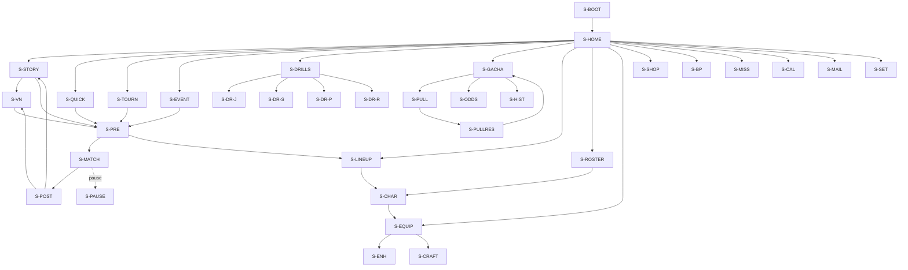

# UI Screens — Inventory, Navigation, HUD, Ceremony, FTUE, Accessibility

Wave-3 doc. Owns: screen inventory, nav graph, match HUD (both orientations), lineup builder, gacha pull ceremony, FTUE sketch, accessibility. Non-goals: visual art style and asset cost (→ `docs/art-budget.md`), engineering (UI lives in `VG.UI` per `docs/data-schemas.md` §3; HUD binds to gameplay only via `VG.Data` event interfaces).

Orientation caveat [structural]: the portrait-vs-landscape decision is UNMADE (M0 A/B gate, PLAN §2.5 / `docs/m0-gameplay-spec.md` §8.3 check 3). The match HUD is specced for BOTH rigs (§3). All meta screens are specced as orientation-agnostic single-column layouts that reflow; they lock to the winning orientation at the M0 gate.

Vocabulary per wave-2 contract: grades Perfect/Great/Good/Miss, receive display S/A/B/C/Shank, Hype 0–100 → Ignition, currencies `gems_free/gems_paid/coins/training_points`, rarities R/SR/SSR, quality ∈ [0,1].

---

## 1. Screen Inventory

Milestone = first milestone the screen must exist in shippable form (PLAN §6). Overlays (pause, FTUE guidance, toasts) are layers, not screens.

| ID | Screen | Milestone | Purpose / key elements | Refs |
|---|---|---|---|---|
| `S-BOOT` | Boot / title | M0 (debug) → M4 (real) | Splash + legal (≤5 s, cached after first run), tap-through title. Offline through M4 — no login screen until M5 (PLAN §5.4) | PLAN §5.4 |
| `S-HOME` | Home hub | M1 | Primary CTA = "Continue" (deep-links to next story node); tiles for every §1 destination; badge dots (mail, missions, drills remaining, banner pity near soft-ramp) | — |
| `S-STORY` | Story map | M4 | Arc → chapter list → match nodes (`StoryChapterDef`); opens scrolled to furthest unlocked node [structural — 3-tap rule §2]; banner-unlock flags on climax nodes | schemas §1.10, story bible §3 |
| `S-VN` | VN scene player | M4 | Portraits + text, auto/skip/log, name display rules (story bible §1.4); flavor-only choices arc 1 | story bible §7 |
| `S-PRE` | Pre-match | M1 | Opponent card (`OpponentTeamDef`: name, tier, gag blurb), format (To11/15/25), lineup summary + one-tap edit → `S-LINEUP`, tactic slot (§4.4), manual/auto choice per PLAN §2.7 (auto only if `autoUnlocked`), assist-mode shortcut (§7), **Play** | schemas §1.13 |
| `S-MATCH` | Match (HUD) | M0 debug → M1 | §3 | m0 spec |
| `S-PAUSE` | Pause overlay | M1 | Freezes sim; resume re-arms open input window from its opening tick (m0 spec §1.3) — show "window re-armed" note; forfeit (double confirm); settings shortcut (assist, haptics, reduce-slow-mo) | m0 spec §1.3 |
| `S-POST` | Post-match results | M1 | Score, reward grade S/A/B/C, rewards with manual **+20%** badge (PLAN §2.7), Hype peak, rally count, save-replay option; story: continue → `S-VN`; farm: repeat/auto buttons | schemas §2.8 |
| `S-QUICK` | Quick Match setup | M1 | Opponent tier pick (Easy/Normal/Hard), To11, Play | PLAN §2.4 |
| `S-LINEUP` | Lineup builder | M2 | §4 | schemas §2.7 |
| `S-ROSTER` | Character list | M2 | Owned roster grid: rarity, position, level, LB stars; sort/filter by `Position`/`Playstyle`/rarity; MC pinned first (not gacha, trains via drills) | schemas §1.3 |
| `S-CHAR` | Character detail | M2 | Stats (raw 0–200 + PI contribution), level/XP apply (coins per economy §4.1), LB shards + star-up, signature (level 1–10, primitive text, cut-in preview), passive, bond groups (fiction blurb → story bible §5), equip loadout (4 slots → `S-EQUIP` picker) | economy §4, schemas §2.2 |
| `S-GACHA` | Banner screen | M2 | §5.1 — banner art, featured SSR, **pity counter + odds link always visible [structural — compliance]**, pull ×1/×10, banner switcher | schemas §1.8 |
| `S-PULL` | Pull ceremony | M2 | §5.2–5.4 beat sheet | — |
| `S-PULLRES` | Pull results summary | M2 | 10-card grid, NEW/dupe→shard chips, repeat-pull button (re-confirms spend) | economy §4.3 |
| `S-ODDS` | Odds / details page | M2 | Full rate table — **per-rarity AND featured-vs-off-banner split** — incl. soft-pity ramp (economy §3.1), pool list, pity rules text, exchange/guarantee rules; one tap from `S-GACHA` [structural — compliance granularity per `docs/compliance-localization.md`] | economy §3 |
| `S-HIST` | Pull history | M2 | Itemized pulls (banner, time, result, pity count at pull), lifetime pull counter (`PityState.lifetimePulls`) | schemas §2.5 |
| `S-EQUIP` | Equipment inventory | M3 | Grid by slot/set/rarity, substats shown (rolled once, immutable — no reroll UI exists [structural]), lock toggle, salvage multi-select → Fabric | economy §6, schemas §1.6 |
| `S-ENH` | Equipment enhance | M3 | Upgrade +0→+12, coin cost curve, milestone framing at +4/+8/+12 (economy §6.4), before/after main-stat preview | economy §6.4 |
| `S-CRAFT` | Crafting | M3 | Fabric balance, slot chooser, **crafting pity counter visible** (guaranteed desired-set SSR every 10th craft, economy §6.5) [structural mechanism] | economy §6.5 |
| `S-DRILLS` | Daily drills hub | M3 | 4 drill cards (attempts left of `dailyCap`, stat trained, MC stat + today's gain), streak calendar strip, TP earned today. Tapping a card **starts the drill** (details on long-press) [structural — 3-tap rule] | schemas §1.11, economy §5 |
| `S-DR-J/S/P/R` | Drill screens ×4 (Jump / Serve / Spike / Receive) | M3 | Each ≤60 s [structural]; distilled core-mechanic input (PLAN §3.2); score grade → stat XP; result strip with MC stat tick-up | PLAN §3.2 |
| `S-TOURN` | Weekly tournament | M4 | AI ladder bracket, placement + reward tiers (economy §2), manual-only rule note (PLAN §2.7), Signature Manuals stock | economy §2, §4.4 |
| `S-EVENT` | Event hub | M5 | Monthly event listing, special-rule stages, event shop | economy §2 |
| `S-SHOP` | Shop | M5 | Gem packs, monthly card, first-purchase doubles, paid-only bundles; `gems_paid` only enters here | economy §7 |
| `S-BP` | Battle pass | M4 (free track) → M5 (premium) | 50 levels, free/premium tracks, season = banner window (6 wk); never characters/shards/gear power [structural] | economy §7 |
| `S-MISS` | Missions & achievements | M3 | Daily (4 drills + 1 match), weekly chest, beginner 7-day, achievements; claim-all | economy §2 |
| `S-CAL` | Login / streak calendar | M3 | Monthly login track + drill streak; additive gems only, no punitive framing [structural — economy §5.4] | economy §5.4 |
| `S-MAIL` | Mail / compensation | M5 | Inbox with attached `Reward`s, claim-all, expiry dates; compensation is a `gems_free` faucet (economy §1) | economy §1 |
| `S-SET` | Settings | M1 | Accessibility (§7), audio, orientation lock (if gate keeps both), account (M5), licenses/rates legal links | — |

Layer inventory (not screens): FTUE guidance layer (§6), toast/reward layer, confirm-spend dialog (every gem spend, shows `gems_free`/`gems_paid` split — free spent first [structural — economy §1]), Ignition/cut-in overlays (gameplay-side, m0 spec §5).

---

## 2. Navigation Graph & the 3-Tap Rule

**Rule [structural — "respect the session", PLAN §1.4]:** every core-loop verb (start a match, run a drill, do a pull) is reachable in **≤3 taps from `S-HOME`**. A "tap" = a discrete screen-advancing touch; pre-selected defaults (current banner, furthest story node, saved lineup) cost zero.



### 2.1 3-tap audit (acceptance check)

| Core-loop verb | Path from Home | Taps | Enabling default |
|---|---|---|---|
| Start story match | Story (1) → match node (2) → Play (3) | **3** ✓ | Story map opens at furthest unlocked node; lineup pre-filled; `S-HOME` "Continue" CTA compresses this to 2 |
| Start quick match | Quick Match (1) → Play (2) | **2** ✓ | Last-used tier remembered |
| Run a drill | Drills (1) → drill card (2, starts immediately) | **2** ✓ | Card tap = start [structural]; long-press for details |
| Do a pull | Gacha (1) → Pull ×10 (2) → spend confirm (3) | **3** ✓ | Current banner pre-selected; confirm is non-removable (compliance, `docs/compliance-localization.md`) |

Hub placement: portrait → bottom tile grid + bottom nav bar; landscape → left rail. Same graph either way; only anchor positions move (decided at M0 gate).

---

## 3. Match HUD

Binds to sim events only (never reads sim state directly — `VG.UI` → `VG.Data` interfaces, schemas §3). Sim fidelity and input sampling are never degraded by HUD load; only presentation degrades [structural].

### 3.1 Element inventory (both orientations)

| Element | Content | Behavior | Ref |
|---|---|---|---|
| Score / set strip | `SUZ 07 : 09 MEI`, format target ("to 11/15/25"), serve-possession dot | Persistent; pulses on point | m0 §1.1 |
| Rotation strip | 6 chips in rotation order + libero chip (off-tint); server highlighted; front-row chips visually raised | Updates on `Rotation`; libero auto-swap animates chip exchange (surfaced per story bible match 7) | m0 §1.1, PLAN §2.4 |
| Hype meters ×2 | 0–100 per team; Ignition at 100 = meter ignites + edge glow (vignette is camera-side, m0 C12) | Fill deltas per m0 §3.7 table; drain from signature spend | m0 §3.7 |
| Signature-ready indicator | Portrait chip of the character owning the upcoming contact glows when team Hype ≥ `hypeCost` AND state ∈ the 5 ownable states (m0 §1.3); tap chip (or SIG button) → cut-in | Never shown when illegal — the button IS the legality display [structural] | m0 §1.3 |
| Contact prompts | §3.2 timing ring / landing indicator / power meter / lane picker | Per contact type | m0 §3–4 |
| Grade popup | Perfect/Great/Good/Miss with **shape + color + text** (§7 — never color alone) | 0.4 s at contact point; receive shows S/A/B/C/Shank letter | m0 §3.3 |
| Pause | Corner button → `S-PAUSE` (forfeit lives inside pause, never on HUD) | Window re-arm rule on resume | m0 §1.3 |

### 3.2 Contact prompt spec (consistent with m0 §3.1 window model)

**Timing ring** (receive tap, spike apex, block jump): a ring closes onto the contact point, reaching center exactly at ideal tick `t*`. Three concentric bands render Perfect/Great/Good widths **proportional to the actual window ms** (`W_grade`, m0 §3.1) — so stat-widened and set-grade-scaled (`ctx`) windows are *visibly* bigger, and quick sets *look* tight. Miss = ring fully closed.

- **Assist-mode variant** (m0 §7.4): bands widen by the assist multiplier (+25/+50%) and render with a distinct dashed outer edge, so assisted timing reads as assisted (honesty cue, also flags score screens).
- **Serve**: hold-release power meter (vertical bar, sweet band = timing window; band width scales with `ctx` from aim risk — aiming near lines visibly shrinks it, m0 §4.2) + drag reticle on the 3×3 zone grid with risk tint on line/corner zones.
- **Receive**: shrinking landing indicator (m0 T5) + commit button per candidate receiver; after commit, timing ring at arrival.
- **Spike**: ring at apex + swipe rose overlay (line/cross/roll/feint mapping per m0 §4.3) shown as faint directional ghosts during approach.
- **Block**: L/C/R column selector (swipe) + timing ring; early-commit vs read state shown as a lock icon on the chosen column (m0 §4.4).

**Set-selection lane picker** [structural — the MC's court-vision moment, m0 §3.4]: opens on `SetSelect`, 2.5 s real-time at 0.3× dilation (m0 T8) → **≤3 s decision**, countdown ring on the picker. Four options — quick / high-outside / back-row-pipe / dump — gated by receive grade (m0 §3.4 matrix): gated options render locked with the cause ("Receive B — quick unavailable"). Timeout → auto high-outside, capped Good (T8), shown as an auto-pick flash.

### 3.3 Portrait wireframe (behind-baseline camera, one-thumb)

```
┌──────────────────────────────┐
│ ⏸  SUZ 07 : 09 MEI   ·to 11· │  score strip
│ HYPE ▓▓▓▓▓▓░░ 62 | 35 ░░▓▓▓  │  twin hype bars (ignite @100)
│ [S*][OH][MB][OP][OH][MB] (L) │  rotation strip, *=server
│                              │
│                              │
│        far court             │
│   ┌╌╌╌ zone grid (aim) ╌╌╌┐  │
│   ╎     ◎ landing ring   ╎  │
│   └╌╌╌╌╌╌╌╌╌╌╌╌╌╌╌╌╌╌╌╌╌╌┘  │
│  ───────── net ────────────  │
│        near court            │
│           ⊙ timing ring      │
│         (at contact pt)      │
│                              │
│ ┌─────┐┌─────┐┌─────┐┌─────┐ │  lane picker (SetSelect only)
│ │QUICK││HIGH ││PIPE ││DUMP │ │  gated cards locked+reason
│ └─────┘└─────┘└─────┘└─────┘ │  countdown ring on row
│                              │
│              [✦ SIG]         │  signature button, thumb arc
└──────────────────────────────┘  (mirrorable, §7)
```

### 3.4 Landscape wireframe (side-on drama, two-thumb)

```
┌────────────────────────────────────────────────────────┐
│ ⏸   SUZ 07 : 09 MEI ·to 11·                            │
│┌──┐                                                ┌──┐│
││H │   ┌╌╌╌╌╌╌╌╌╌╌╌┐ net ┌╌╌╌╌╌╌╌╌╌╌╌╌┐            │H ││
││Y▓│   ╎ own court ╎  │  ╎ far court  ╎            │Y░││
││P▓│   ╎  ⊙ timing ╎  │  ╎ ◎ landing  ╎            │P░││
││E▓│   ╎    ring   ╎  │  ╎   ring     ╎            │E░││
│└──┘   └╌╌╌╌╌╌╌╌╌╌╌┘  │  └╌╌╌╌╌╌╌╌╌╌╌╌┘            └──┘│
│ [S*]                                                   │
│ [OH]        ( SetSelect: radial picker      )          │
│ [MB]        (   QUICK / HIGH / PIPE / DUMP  )          │
│ [OP]        (   around the setter, gated    )          │
│ [OH]                                                   │
│ [MB](L)                                       [✦ SIG]  │
└────────────────────────────────────────────────────────┘
```

### 3.5 What moves between orientations

| Element | Portrait | Landscape | Invariant |
|---|---|---|---|
| Score strip | Top center | Top center | Identical |
| Hype meters | Horizontal pair under score | Vertical bars, screen edges L/R | Same data, same ignite tell |
| Rotation strip | Horizontal row under Hype | Vertical rail, left edge | Same chips |
| Lane picker | Bottom card row (thumb reach) | Radial around setter (two-thumb reach) | Same 4 options, same gating, same ≤3 s timer |
| Timing ring / landing indicator | In-world at contact point | In-world at contact point | **Never moves — world-anchored both rigs [structural]** |
| SIG button | Bottom, dominant-thumb arc (mirrorable §7) | Bottom corner, dominant side | Same legality rule |
| Pause | Top corner opposite thumb | Top-left | Forfeit always inside pause |
| Cut-ins / Ignition overlay | Full-screen both rigs (m0 C11/C12 [structural]) | same | — |

Swipe-direction reference frames differ by rig (screen-up vs court-forward, m0 §4.3) — the swipe rose overlay absorbs this; the player never learns two gesture sets, the rose just rotates.

---

## 4. Lineup Builder (`S-LINEUP`, M2)

Backed by `LineupState` (schemas §2.7): `slots[6]` rotation order, libero, bench ≤4 [tunable].

### 4.1 Layout

```
┌──────────────────────────────┐
│  PI 0.41   Bonds: 2/3 active │  header readouts
│      ── net ──               │
│   [4:OH] [3:MB] [2:OP]       │  front row (raised)
│   [5:OH] [6:MB] [1:S*]       │  back row, 1 = next server
│          (L)                 │  libero slot, off-tint
│  bench: [ ][ ][ ][ ]         │
│  Tactics: [Balanced ▸]  (M2/M3)│
│  ── bond panel (scroll) ──   │
│  ✓ Documentary Subjects +2%… │
│  ✓ Seance and Spite   +2%…   │
│  ○ 100% High-Five Ins. (1/2) │
└──────────────────────────────┘
```

Interaction: tap slot → roster picker filtered to legal candidates; drag between slots to swap rotation order. Court-shaped arrangement (not a list) so front/back rows read diegetically.

### 4.2 Position legality display

| Check | Display | Source |
|---|---|---|
| Exactly one `S` in slots | Missing/duplicate setter = red slot badge + disabled Confirm | schemas §2.7 invariant |
| Libero slot accepts `L` defs only | Non-L greyed out in picker | schemas §2.7 |
| Off-position placement (e.g. L in slots, MB at OP) | Allowed where schema allows, but slot shows amber "off-position" chip [tunable policy — M2 decides if off-position carries a stat penalty or is simply permitted] | — |
| Front/back legality | Informational only — rotation is automatic in-match (PLAN §2.4); builder shows which slots start front-row | m0 §1.1 |
| MC | MC is the setter [structural]: `char.mc` pre-fills the S slot; replaceable only by another owned S (Hisame), which the UI calls out ("benching the protagonist" flavor line — comedy hook, [tunable fiction]) | story bible §2 |

### 4.3 Bond-link visualization (economy §4.6, schemas §1.14)

- Thin link lines drawn between fielded members of each bond group, colored per group; bench members excluded (activation = ≥2 among slots+libero [tunable threshold]).
- Bond panel lists every group with ≥1 fielded member: **active** (✓, bonus text, comedic theme name per story bible §5), **partial** (○, "1/2 fielded", tap → shows missing member), **lit-but-uncounted** — when >3 groups are active, excess groups stay visually lit but show "no effect (3-bond limit)" [structural — economy §4.6: up to 3 counted; the UI must not imply stacking beyond the cap].
- Which 3 count: highest-bonus first, ties by activation order; the counted set is explicitly badged `#1 #2 #3` [tunable rule — must match meta-layer resolution exactly].

### 4.4 Readouts

| Readout | Definition | Ref |
|---|---|---|
| **PI** | Power Index = lineup mean normalized stat (raw/200) with gear/set/LB/bond multipliers applied; updates live on any change; delta chip vs saved lineup (`+0.02 ▲`) | economy §8.2 |
| Bond total | Sum of counted bond % (cap ≤ +6% PI [structural]) | economy §4.6 |
| Set bonuses | Per-character 2pc/4pc chips (from equipped gear) | economy §6.3 |
| **Tactic profile slot** | Shows equipped `TacticProfileDef` (default `tactic.balanced_default`). Slot is present from M2 (plumbing exists) but read-only; **player-facing tactic editing ships M2/M3 [tunable]** and is reused verbatim by ghost PvP in V1.x (tactics never carry execution skill [structural — schemas §1.12]) | schemas §1.12 |

---

## 5. Pull Ceremony & Gacha Screens

*(Compliance placements in this section are cross-referenced by `docs/compliance-localization.md`.)*

### 5.1 Banner screen (`S-GACHA`) — always-visible compliance elements [structural]

```
┌──────────────────────────────┐
│ ◂ banners ▸   "Six Persons"  │
│   (featured art: Ikaruga)    │
│  ✦ featured SSR + rate-up    │
│                              │
│ pity: 37/80 · SSR guaranteed │  ← live PityState.pullsSinceSsr
│       within 43 pulls        │
│ 50/50: guarantee ACTIVE      │  ← featuredGuarantee, shown only when set
│ [ Odds & rules ]  [History]  │  ← 1 tap to S-ODDS [structural]
│                              │
│ [ Pull ×1  160 ] [ Pull ×10  1600 ] │
└──────────────────────────────┘
```

- Pity counter and odds link are **on the banner screen itself, never nested, positioned above the pull buttons** — disclosure precedes purchase [structural — compliance; PLAN §4: "pity counters visible in-UI"; store-policy detail in `docs/compliance-localization.md`].
- Every pull button → confirm-spend dialog showing the `gems_free`/`gems_paid` split (free first [structural — economy §1]).
- Soft-ramp nudge: at `pullsSinceSsr ≥ 65` the pity line gains a subtle highlight ("rate rising") [tunable] — the honest version of anticipation.
- 1600 = 10×160; any "value" messaging on the ×10 button is prohibited (economy §1: no discount exists) [structural].

### 5.2 Diegetic frame [tunable fiction]

**Recommendation: "Recruitment Letters."** A club-application envelope arrives at the Suzugahama gym mailbox — the Concord requires all transfers to be notarized, so every reveal ends with a stamp. Comedy skin played straight per story bible §1.5: the institution is absurd (notarized recruitment, Article 7 citation on the wax seal), the character reveal itself is sincere. Never joke about the pull result [structural — story bible §1.5: no jokes mocking the player's pulls].

Rarity tells escalate through the envelope, before the name is known:

| Tell channel | R | SR | SSR |
|---|---|---|---|
| Envelope | Plain paper | Silver-trimmed | Gold, slightly too large |
| Wax seal | Rubber stamp | Silver wax | Gold wax, Concord crest, faint glow |
| Gym lighting | Normal | Warm shift | Spotlights snap on; crowd murmur |
| Audio | Paper rustle | Chime layer | Music drops to heartbeat, then swells |

Tells are shared assets across all characters of a rarity (one VFX set ×3 rarities — cost note → `docs/art-budget.md`).

### 5.3 Beat sheet — single pull

Timing budget: **≤20 s total single pull [tunable]**. All beats tap-to-advance after 0.3 s.

| # | Beat | Content | R/SR | SSR |
|---|---|---|---|---|
| B1 | Initiation | Gym mailbox creaks; envelope slides out | 1.5 s | 1.5 s |
| B2 | Anticipation | Envelope close-up, seal fills frame | 2.0 s | 2.5 s |
| B3 | Escalation tell | Rarity tells fire (§5.2 table); no name yet | 1.5 s | 2.5 s |
| B4 | Reveal | Seal breaks → character card: portrait, name, position, playstyle tag, rarity stars | 3.0 s | 3.0 s |
| B5 | SSR ceremony | **Signature-move cut-in plays — reuses the character's C11 cut-in Timeline asset (m0 spec §5) verbatim [structural — budget: zero bespoke gacha animation per character; cost note → `docs/art-budget.md`]**, shouted move name rendered | — | 2–4 s |
| B6 | Dupe conversion | First copy: "NEW" stamp (notarized, thunk). Dupe: shards burst out (R 15 / SR 40 / SSR 125, economy §4.3) into the character's LB progress bar with before→after stars | 1.5 s | 1.5 s |
| B7 | Outro | Card settles → `S-PULLRES` | 1.0 s | 1.0 s |
| | **Total** | | **≈10.5 s** | **≈16 s ≤ 20 ✓** |

### 5.4 Ten-pull rules

Timing budget: **≤45 s total [tunable]**.

- B1–B2 play once (a bundle of ten envelopes, 4 s).
- Cards reveal sequentially in compressed form (tell+reveal ≈ 2.5 s each for the first nine ≈ 22.5 s).
- **Reveal order builds to the highest rarity [structural]:** cards sorted ascending by rarity (ties keep roll order); the highest-rarity result is always last and gets the full B2–B5 treatment (≈ 8 s incl. cut-in). Total ≈ 38 s ✓.
- Anti-spoiler rule: an earlier card's tells never leak later contents; no "rainbow envelope on the pile" ambient tell in v1 [tunable — genre-standard ambient tells can be added later, but default is no-leak so the build is real].
- Grant-before-show [structural]: all ten results are committed to save the instant the confirm resolves; the ceremony is pure presentation (an app kill after confirm loses nothing — schemas §4 determinism, `Gacha` stream).

### 5.5 Skip rules

| Rule | Behavior |
|---|---|
| Tap-to-advance | Any beat, after 0.3 s, always |
| Per-character skip [structural] | A character's full ceremony (incl. SSR cut-in) is **skippable only after first view of that character** — first meeting is always watched; `SKIP` button appears from the second copy onward |
| Ten-pull "Reveal all" | Appears after the first card if every remaining character has been seen before; jumps to `S-PULLRES` — except a first-view highest-rarity card still plays (per-character rule wins) |
| Reduced-flash variant | §7 — ceremony honors reduce-flash setting (no strobe on SSR spotlight snap) |

---

## 6. FTUE Sketch — First 5 Minutes

Full FTUE spec deferred to **M4** (PLAN §6: "New-player hour-one flow tested on 5 humans"). This is the load-bearing sketch.

**Target [structural]: first spike lands ≤60 s from app start.** Cold open INTO a rally — the product leads with the product.

| t (cum.) | Beat | Detail |
|---|---|---|
| 0:00 | Boot | Splash + legal ≤5 s; no login (offline through M4) |
| 0:05 | Cold open | No title screen menu — smash-cut mid-tryout: story match 1 fiction (the tryout is a single rally; the retired 3rd-years showed up out of habit — story bible §3 Act 1). One VO/text line, ball already in the air |
| 0:10 | Receive | Serve arrives; single guided input (landing ring + timing ring, §3.2); scripted-friendly AI (Easy tier, m0 §6.2) |
| 0:20 | Set | Lane picker opens with one lit lane (high-outside); the other three visible-but-locked — teaches the gating grammar without words |
| 0:35 | **First spike** | Apex ring + swipe; contact slow-mo + camera punch-in (m0 C7) — the signature sensation, inside the first minute. **≤0:60 ✓** [structural target] |
| 0:40 | Title drop | Kill replay + floor-slam decal → game logo over the frozen frame; then rally 2–3 of the tryout un-guided (short To-3 script [tunable]) |
| 1:45 | Story frame | First VN scene: club, Article 7 gag, MC name/pronoun select (story bible §2) |
| 2:45 | First pull — scripted | Banner 1 "Six Persons" (story bible §6) opens with a granted free multi; **scripted result [tunable — fixed script vs seeded]: guaranteed Ikaruga Taiga (featured SSR) + starter spread**. Full ceremony §5.3, not skippable (first views). Pity/odds UI visible even on the scripted pull [structural — compliance: never misrepresent odds; scripted pull labeled as a gift, details in `docs/compliance-localization.md`] |
| 3:45 | Lineup touch | Guided: slot Ikaruga into an OH slot in `S-LINEUP`; bond line to MC lights ("Documentary Subjects") — pull → lineup → on-court difference, the M2 gate loop in miniature |
| 4:15 | Dailies unlocked — day 1 | Run Jump Training once (≤60 s drill); MC stat visibly ticks up |
| 5:00 | Home | Hub tour is passive (badge dots, no forced taps [tunable]); Continue CTA points at match 2 |

Guardrails: every FTUE gate is a real input, never a "tap the glowing button to watch the game play itself"; assist mode is offered (not forced) after 2 consecutive Misses on the same contact type [tunable]; FTUE completion state in save (schema field → M4).

---

## 7. Accessibility

All options in `S-SET`; assist mode also surfaced on `S-PRE` and via the miss-streak offer (§6).

| Feature | Behavior | Default | Label |
|---|---|---|---|
| Assist mode | Timing-window widen +0 / +25 / +50% (m0 §7.4), player windows only, never AI; dashed-ring visual (§3.2); flagged on score screens for leaderboard-adjacent modes | Off | [structural mechanism, tunable steps] |
| Colorblind-safe grades | **Grades always differ by shape/icon + text, never color alone [structural]:** Perfect = gold ✦ star, Great = blue ● circle, Good = grey ▲ triangle, Miss = ✕ cross; receive grades are letterforms (S/A/B/C/Shank) by construction | Always on | [structural] |
| Palette presets | Deuteranopia / protanopia / tritanopia variants for team tints, zone-risk tint, bond-link line colors | Off | [tunable palettes] |
| Text scale | 100 / 115 / 130%, honors OS text-size on first run; layouts reserve headroom (see below) | OS | [tunable] |
| Haptics | Master toggle + per-grade patterns as feel juice: Perfect = sharp tick, Great = soft tick, Good = faint, Miss = none [tunable patterns]; ceremony beats B3/B4 haptic | On | [tunable] |
| Left/right-hand mirror (portrait) | Mirrors HUD control anchors (SIG button, pause corner, lane-card order stays court-mapped) — **never mirrors the court/world** | Right | [structural option] |
| Reduce slow-mo | Caps time dilation at 0.7 (m0 §7.4, vestibular comfort) | Off | [structural] |
| Reduce shake/flash | Disables screen shake, caps flash luminance steps (impact language PLAN §2.3; ceremony spotlight snap §5.5) | Off | [tunable] |
| Screen reader | Meta screens (everything except `S-MATCH`/drills) labeled for OS screen readers — M4 pass | — | [tunable scope] |
| One-handed play | Portrait rig is designed one-thumb end-to-end (PLAN §2.5); no HUD element outside thumb arc except pause | — | gate-pending |

Layout constraints (from `docs/compliance-localization.md`): all UI strings are LocKeys, no hardcoded text; every text container reserves **~+35% width headroom** for localization expansion [structural — loc].

---

Cross-doc: timing/windows/camera → `docs/m0-gameplay-spec.md`; amounts/rates/pity math → `docs/economy-progression.md`; fiction/tone/banner order → `docs/story-bible.md`; schemas/state → `docs/data-schemas.md`; disclosure/loc rules → `docs/compliance-localization.md`; asset costs → `docs/art-budget.md`.
